# Swagger Petstore Postman 接口测试项目
> 基于 Swagger Petstore 公开 API，使用 Postman 完成用户与宠物模块核心接口的功能测试，包含完整的业务链路调用与多层级断言验证。

## 📌 项目简介
本项目针对 Swagger Petstore 开放 API 进行接口功能测试。采用 Postman 作为测试工具，不仅验证单接口正常与异常场景，还通过**环境变量**串联完整业务链路：**创建用户 → 查询用户 → 用户登录 → 新增宠物 → 按ID查询 → 按状态查询 → 更新宠物 → 删除宠物**。

## 🧪 测试环境
- **被测系统**：Swagger Petstore API (`https://petstore.swagger.io/v2`)
- **测试工具**：Postman
- **环境变量文件**：`环境/petstore_env.json`
- **测试数据**：通过 Pre-request Script 脚本动态生成带时间戳的唯一测试数据，避免重复数据冲突

## 📂 文件目录说明
```text
Petstore-API测试/
├── 收藏/
│   └── swagger_petstore_collection.json  # Postman接口集合（含Tests断言脚本）
├── 环境/
│   └── petstore_env.json                 # Postman环境变量配置文件
├── 截图/
│   ├── 01_user_assertions.png        # 用户模块断言结果截图
│   ├── 02_pet_assertions.png         # 宠物模块断言结果截图
│   ├── 03_error_404.png              # 异常场景404断言截图
│   └── runner_summary.png            # Collection Runner批量运行总览
└── README.md                         # 项目说明文档
```

## 🔗 接口执行顺序与依赖说明
测试按照真实业务流执行，后面接口依赖上一步接口返回数据：
1. `POST /user` - 创建用户（生成唯一用户名）
2. `GET /user/{username}` - 根据用户名查询用户，校验返回数据
3. `GET /user/login` - 用户登录，获取会话信息
4. `POST /pet` - 新增宠物，提取petId存入环境变量 `{{savedPetId}}`
5. `GET /pet/{petId}` - 根据ID查询宠物，依赖上一步petId
6. `GET /pet/findByStatus` - 按状态查询宠物列表
7. `PUT /pet` - 更新宠物信息，复用petId
8. `DELETE /pet/{petId}` - 删除宠物

## ✅ 断言设计与测试策略
每个接口Tests脚本采用四层校验策略：
1. **HTTP状态码校验**：正常场景校验200，异常场景校验404
2. **响应头校验**：校验Content-Type为`application/json`
3. **响应体结构校验**：校验关键字段是否存在、字段类型（数字/字符串）
4. **业务数据校验**：比对返回id、name、status与请求入参是否一致

**异常场景**：查询不存在宠物ID，验证接口正确返回404。

## 📊 运行结果
一共执行 8 个接口，13 条测试断言，全部通过，错误数：0。

### 接口断言截图

| 场景 | 截图 |
|------|------|
| 整体集合预览 | 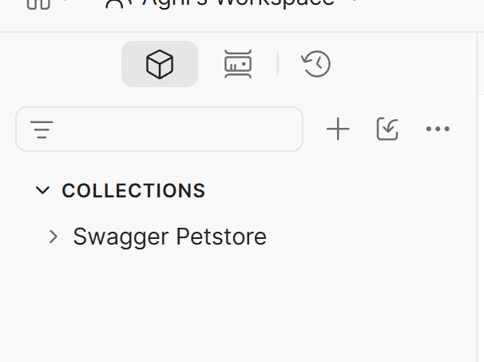 |
| 新增宠物 | 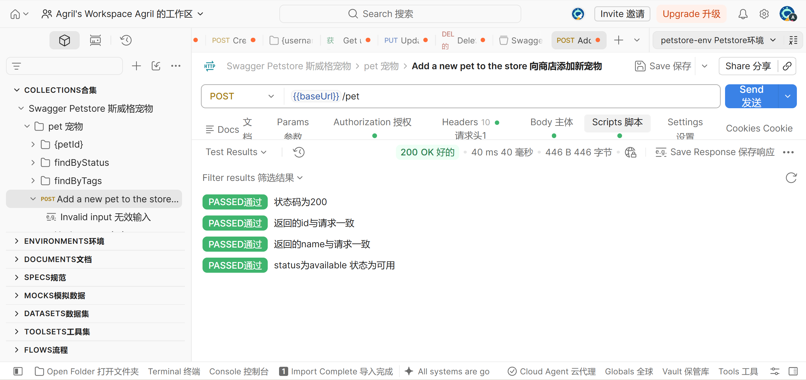 |
| 按ID查询宠物 | 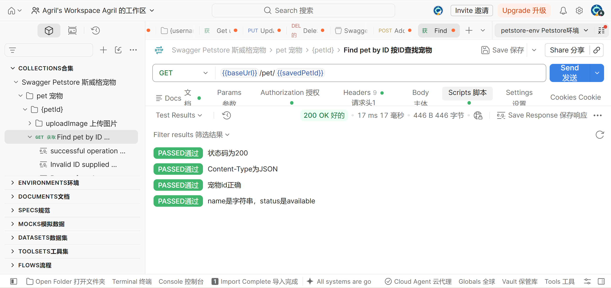 |
| 更新宠物 | 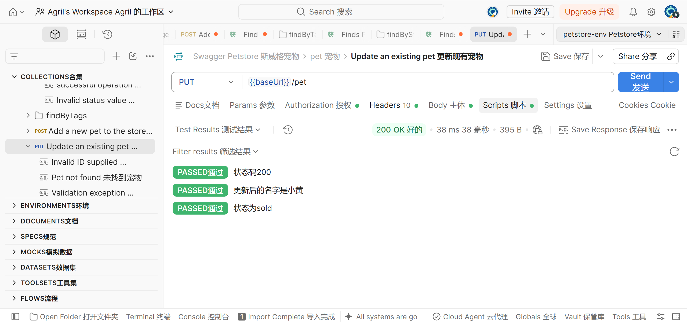 |
| 按状态查询宠物 | 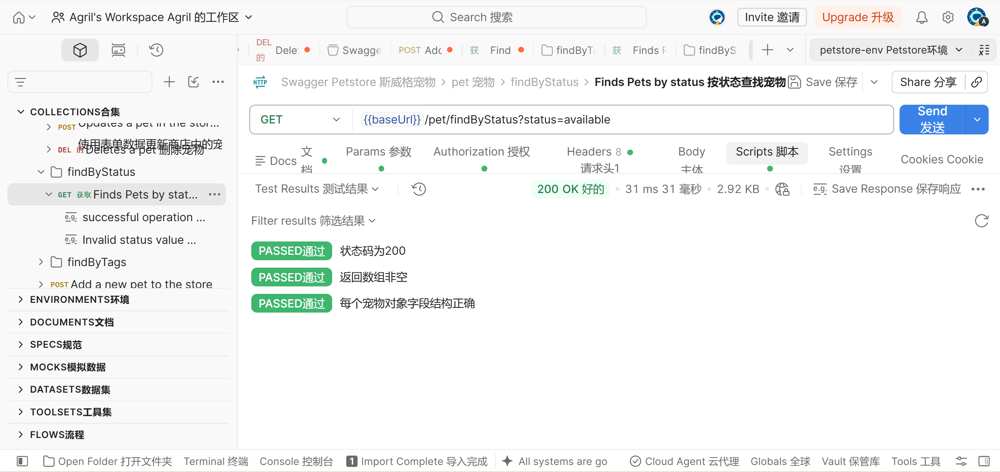 |
| 删除宠物 | 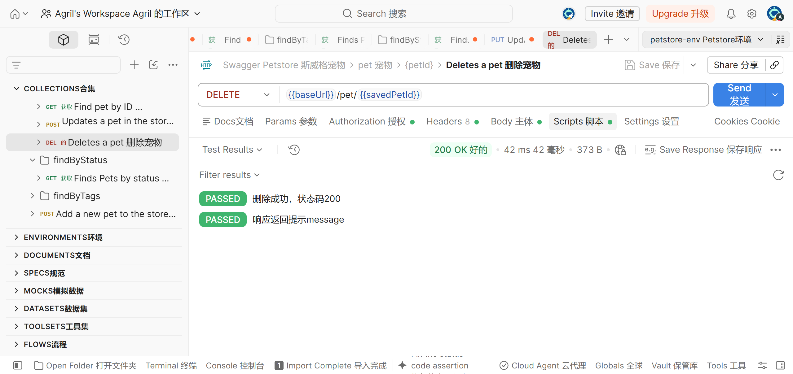 |
| 用户登录 | 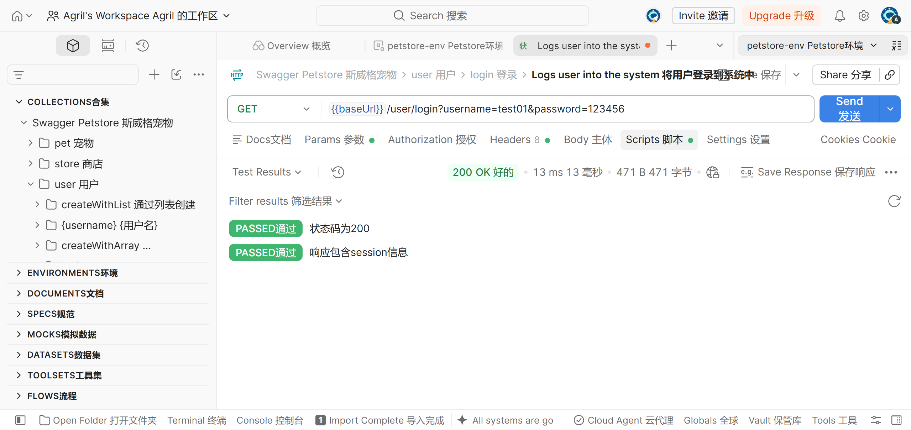 |
| 删除用户 | 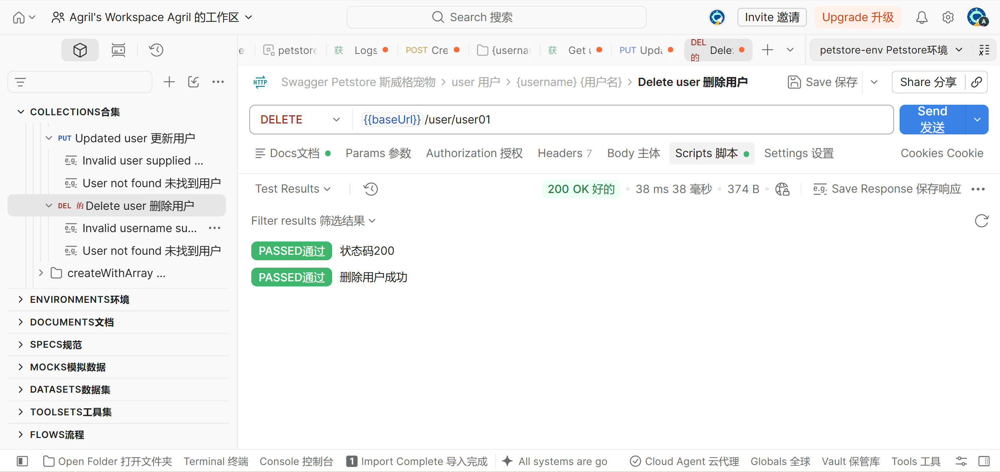 |
| 按用户名查询 | 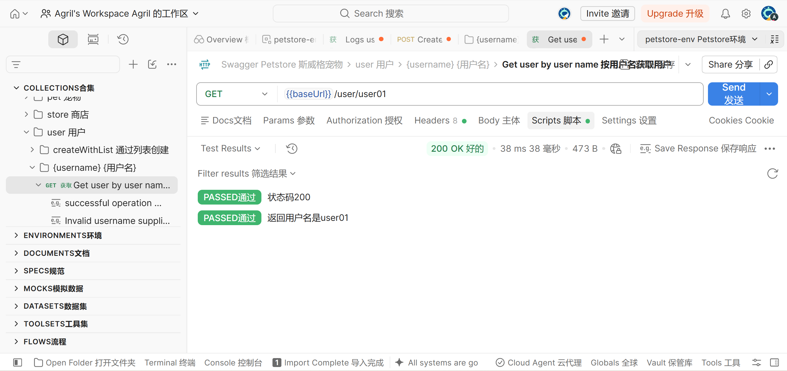 |
| 更新用户 | 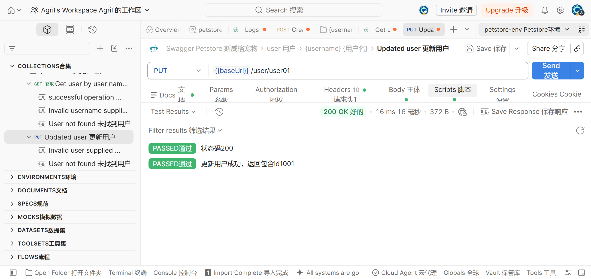 |
| 创建用户 | 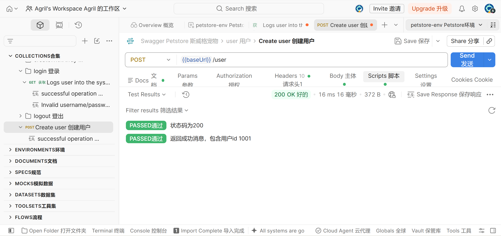 |
| 异常场景404 | 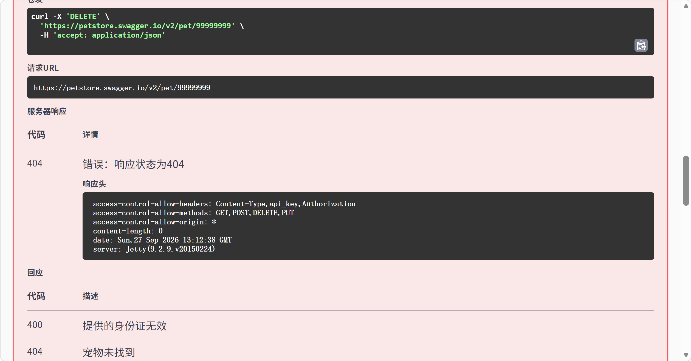 |

### Collection Runner 批量运行总览

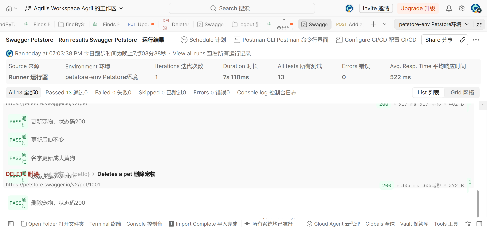

## 🚀 本地复现步骤
1. 导入 `收藏/swagger_petstore_collection.json` 接口集合
2. 导入 `环境/petstore_env.json` 环境文件，Postman右上角选中该环境
3. 打开Collection Runner，选中8个接口，迭代次数=1
4. 执行Run，查看测试报告和断言结果

## 💡 项目亮点
1. **跨接口参数传递**：新增宠物接口通过 `pm.environment.set("savedPetId", ...)` 提取返回的 petId，后续查询、更新、删除接口通过 `{{savedPetId}}` 引用，实现完整的 CRUD 链路。
2. **动态测试数据**：Pre-request Script 使用 `Date.now()` 生成唯一用户名，确保多次运行新增接口不会因用户名重复而失败。
3. **四层断言体系**：以新增宠物接口为例——
   - 第1层：`pm.response.to.have.status(200)`
   - 第2层：`pm.response.to.have.header("Content-Type", "application/json")`
   - 第3层：校验 `id` 为 number、`name` 为 string、`status` 为 available/pending/sold
   - 第4层：`pm.expect(body.id).to.eql(pm.collectionVariables.get("petId"))`
4. **异常场景覆盖**：测试不存在的宠物ID（999999999），验证接口返回 404，确认系统边界处理正确。
```
